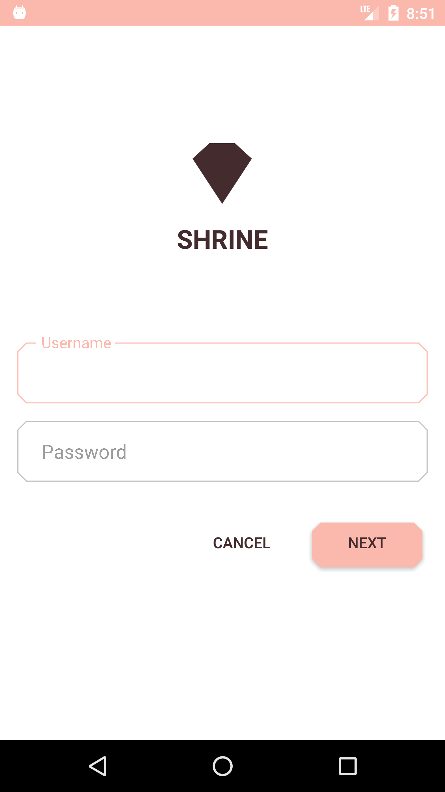
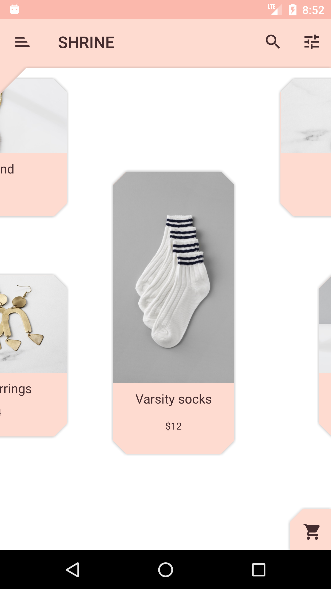
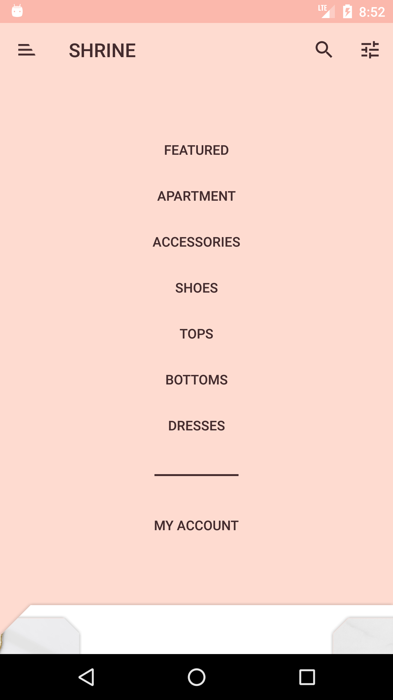

Tried to mimic ShrineApp in https://material.io/design/material-studies/shrine.html.

Added custom Outlined Text View and custom shapes.

The outlined edittext is created customly by me.

Also I have added a view for cut ages.
